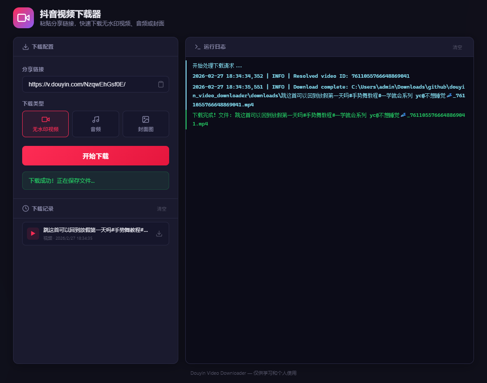

# 抖音视频下载器

**[English](README.md)**

一个专业的抖音视频下载器，提供现代化的 Web 界面和命令行支持。



## 功能特性

- **无水印视频下载** — 自动去除水印（`playwm` -> `play`）
- **多种下载模式** — 视频、音频、封面图
- **智能文件命名** — 以视频标题命名文件，不再是纯 ID
- **实时日志流** — Web 界面通过 SSE 实时显示下载进度和日志
- **双栏 Web 界面** — 左侧为下载配置和历史记录，右侧为实时日志
- **下载历史** — 本地存储最近下载记录，支持一键重新下载
- **短链接解析** — 支持 `v.douyin.com` 分享链接，自动跟随重定向
- **WAF 绕过** — 内置 SHA-256 工作量证明求解器，应对抖音 JS 验证
- **指数退避重试** — 网络波动和 API 错误时自动重试
- **CLI + Web** — 命令行和浏览器两种使用方式

## 项目结构

```
douyin_video_downloader/
├── app.py              # Flask Web 应用（SSE 流式传输、文件服务）
├── downloader.py       # 核心下载引擎
├── utils.py            # URL 提取、重定向解析、日志配置
├── main.py             # 命令行入口
├── templates/
│   └── index.html      # Web 界面模板（双栏布局）
├── static/
│   ├── css/style.css   # 暗色主题样式
│   └── js/app.js       # 前端逻辑（SSE、历史记录、日志面板）
├── downloads/          # 下载文件输出目录
├── logs/               # 滚动日志文件
├── requirements.txt
├── runtime.txt         # Python 版本（3.10.14）
├── Procfile            # 部署配置
└── LICENSE             # MIT 许可证
```

## 环境要求

- Python 3.10+
- 依赖包：`requests`、`Flask`

```bash
pip install -r requirements.txt
```

## Web 界面

```bash
python app.py
```

浏览器打开 `http://127.0.0.1:5000`。

**使用方法：**
1. 在输入框中粘贴抖音分享链接
2. 选择下载类型（视频 / 音频 / 封面图）
3. 点击「开始下载」— 右侧面板实时显示日志
4. 文件自动保存到浏览器下载目录

## 命令行使用

交互模式：

```bash
python main.py
```

带参数运行：

```bash
python main.py "https://v.douyin.com/xxxxx/" --mode video
python main.py "https://v.douyin.com/xxxxx/" --mode audio
python main.py "https://v.douyin.com/xxxxx/" --mode cover
```

参数说明：

| 参数 | 默认值 | 说明 |
|------|--------|------|
| `--mode` | `video` | 下载模式：`video`、`audio` 或 `cover` |
| `--output-dir` | `downloads` | 输出目录 |
| `--connect-timeout` | `10` | 连接超时（秒） |
| `--read-timeout` | `30` | 读取超时（秒） |
| `--retries` | `3` | 最大重试次数 |
| `--backoff-factor` | `1.0` | 指数退避系数 |

## 部署

项目包含 `Procfile`、`runtime.txt` 和 `requirements.txt`，支持一键部署到 Railway、Render 或 Heroku。

```bash
gunicorn app:app --bind 0.0.0.0:$PORT --workers 2 --timeout 120
```

## 许可证

[MIT](LICENSE)
